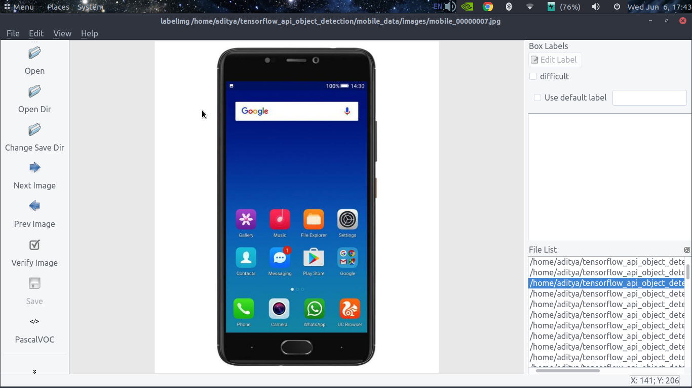

## TensorFlow Object Detection API

**Note :** Here, the project directory is called `Object_Detection`

### Requirements
* Linux Machine
* cudnn 7.0+
* cuda 9.0+
* tensorflow 1.5+


### Step 1 (Data Collection)
* Search for the objects which you intend to classify on Google
* Open the console & copy the contents of download_images.js in it. This will download a **urls.txt** file.
* Run the download_data.py.
```
mkdir images
python3 --urls urls.txt --output images
```

### Step 2 (Image Annotation)
* Now you need to annotate the images you just downloaded in the Pascal VOC format.
* Install LabelImg
```
git clone https://github.com/tzutalin/labelImg.git
cd ~/labelImg

# for python3
sudo apt-get install pyqt5-dev-tools
sudo pip3 install lxml
make qt5py3
python3 labelImg.py
```
* This would open up a window like below. Press 'w' to draw a rectangle around the area of interest and enter the label. Save the file, by pressing 'Ctrl+s', this would create the corresponding XML file in Pascal VOC format.

* Move all the XML files to the annotations directory.


### Step 3 (XML to CSV)
* We need to convert the XML files to CSV so that it can then be converted to TFRecord files.
* Edit xml_to_csv.py to include the desired csv file name & location
```
python3 xml_to_csv.py
```
* Create a directory __data__ & move the mobile_labels.csv to it.

### Step 4 (Creating training & testing data)
* Here, we create 2 seperate csvs train.csv & test.csv in data folder using the mobile_labels.csv, generated above.
```
python3 splitting_labels.py
```

### Step 5 (Installing tensorflow object detection api)

#### Clone the Tensorflow Object Detection Repository
```
git clone https://github.com/tensorflow/models.git 
```
#### Building Protocol Buffer
```
sudo apt-get install protobuf-compiler python-pil python-lxml jupyter matplotlib
sudo apt-get install -y protobuf-compiler
cd ~/models/research
protoc object_detection/protos/*.proto --python_out=.
```

#### Testing the installation
```
cd ~/models/research
python3 object_detection/builders/model_builder_test.py
```
If it runs fine, then it will display an OK message. However, if you get the error __No module named 'object_detection'__, then do the following.
```
cd ~/models/research/object_detection/slim
python3 setup.py build
python3 setup.py install
sudo pip3 install -e .
cd ..
export PYTHONPATH=$PYTHONPATH:`pwd`:`pwd`/slim  
```

### Step 6 (Converting CSVs to TF Record file)
* Tensorflow Object Detection API requires that the training data be in TFRecord format.
```
python3 generate_tfrecord.py --csv_input=data/train_labels.csv --output_path=data/train.record
python3 generate_tfrecord.py --csv_input=data/test_labels.csv --output_path=data/test.record
```

### Step 7 (Downloading the checkpoint of a trained model)
Downloading the ssd_mobilenet_v1_coco_2017_11_17.tar.gz
```
cd ~/Object_Detection
wget http://download.tensorflow.org/models/object_detection/ssd_mobilenet_v1_coco_2017_11_17.tar.gz
tar -xvzf ssd_mobilenet_v1_coco_2017_11_17.tar.gz
```

### Step 8 (Generating a configuration file for the downloaded model)
Tensorflow provides configuration file for a number of pretrained models. You can check them as
```
ls ~/models/research/object_detection/samples/configs
```

Copy the configuration file for ssd_mobilenet_v1_coco_2017_11_17 to our project directory
```
cp ~/github/models/research/object_detection/samples/configs/ssd_mobilenet_v1_coco.config  ~/Object_Detection/training/ssd_mobilenet_v1_mobile.config
```

### Step 9 (Editing the configuration file as per our use case)
Open the copied file in an editor. Edit the following lines as per the use case.
* Line 9 => num_classes : x (x is the number of labels in step 2)
* Line 156 => fine_tune_checkpoint : "ssd_mobilenet_v1_coco_2017_11_17/model.ckpt" (path where to store the model checkpoint)
* Line 175 => input_path : "data/train.record" (path to training data which is stored in TFRecord format)
* Line 177 => label_map_path: "training/object_detection.pbtxt" (path to pbtxt file, which assigns an integer to each label)
* Line 189 => input_path: "data/test.record" (path to validation data which is stored in TFRecord format)
* Line 191 => label_map_path: "training/object_detection.pbtxt" (path to pbtxt file, which assigns an integer to each label)


### Step 10 (Creating a pbtxt file)
* Tensorflow requires us to map a class to a label. So, inside training directory, create a file `object-detection.pbtxt` and add the following content in it:
```
item {
  id: 1
  name: 'mobile'
}
```

### Step 11 (Training the model)
```
python3 ~/models/research/object_detection/train.py --logtostderr --train_dir=training/ --pipeline_config_path=training/ssd_mobilenet_v1_mobile.config
```
* --train_dir is the directory where your trained model checkpoints will be saved.
* --pipeline_config_path is for the model used for training.


### Step 12 (Exporting the inference graph)
```
 python3 ~/models/research/object_detection/export_inference_graph.py --input_type image_tensor --pipeline_config_path training/ssd_mobilenet_v1_mobile.config --trained_checkpoint_prefix training/model.ckpt-3517 --output_directory mobile_inference_graph
```
* --output_directory will then contain the frozen trained model 

### Step 13 (Evaluating the trained detector)
* Create a directory test_images & add some testing images as image1.jpg, image2.jpg, .... imageN.jpg
* Edit line 53 in mobile_detection.py as 

```
TEST_IMAGE_PATHS = [ os.path.join(PATH_TO_TEST_IMAGES_DIR, 'image{}.jpg'.format(i)) for i in range(1, 5) ]
```
* Run the mobile_detection.py script, to check the result
```
python3 mobile_detection.py
```